

    <a href="https://chp-rubicell.github.io/epshape">
        <!--   -->
        
    </a>
     
    

    

    

**EPShape (EnergyPlus Shape Viewer)** is a 3D interactive web-based shape viewer for EnergyPlus Input Data Files (`.idf`) and is a crucial tool for intuitively understanding and checking the IDF model.

## Key Features

- **View IDF model shapes** : Parse the shape information (zones, surfaces, fenestrations, etc.) defined in the `.idf` file and display them in an interactive viewer.
- **Web-based** : Works in modern web browsers without the need for installation or dependencies.
- **Compatibility** : Compatible with a wide range of EnergyPlus versions (tested for 8.9.0 +).
- **Model checking** : Inspect properties of surfaces, fenestrations, and shadings by simply mousing over objects.
- **Customization** : Offers extensive customizations for not only convenient model checking but also rendering high-quality image files fit for various purposes.

## Usage

### Keyboard & mouse controls summary

#### Opening files

- `(file drop)` : Open an IDF file.
- `shift + (file drop)` : Open an IDF file with previous settings.

#### Viewport

- `left mouse` : Rotate the camera.
- `shift + left mouse` : Snap camera angle.
- `right/middle mouse` : Pan the camera.
- `r` : Reset the camera position.
- `s` : Export the viewport as an image.
- `/` : Open the command prompt input field.
- `ctrl + shift + c` : Copy viewport settings.
- `ctrl + shift + v` : Paste viewport settings.

This list is also accessible by pressing the help ('?') button in the
upper right corner.

### Basic navigation

    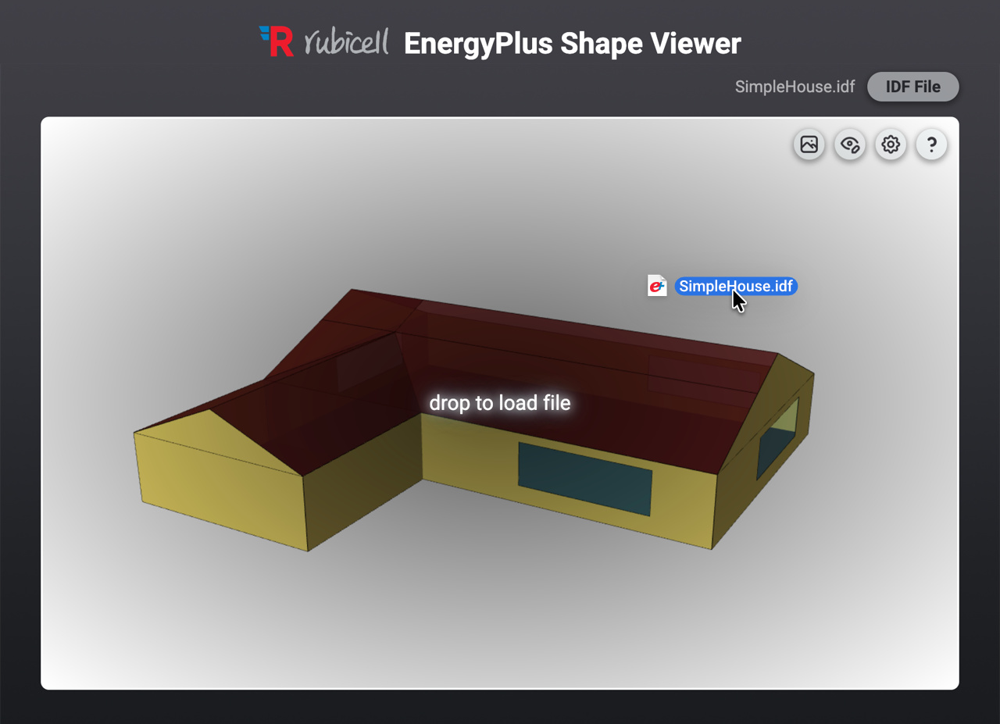
     
    Open an <code>.idf</code> or <code>.expidf</code> file by simply dragging and dropping the file on to the viewer or by pressing the 'IDF File' button.

    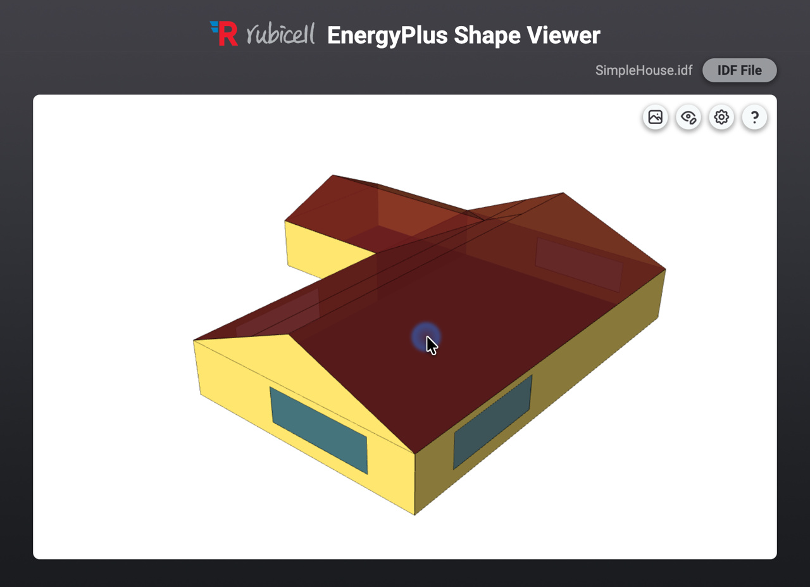
     
    Use the left mouse to rotate the camera and the right or middle mouse to pan the camera. 
    Holding shift while panning the camera snaps the camera angle to increments of 45 degrees. 
    Hit the <code>r</code> key to reset the camera position.

### Model inspection

    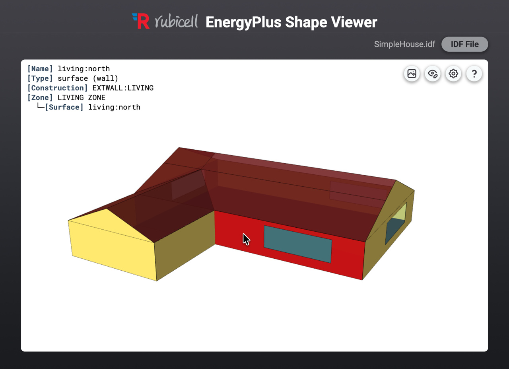
     
    You can mouseover any object to see its properties (name, construction, zone, etc.).

    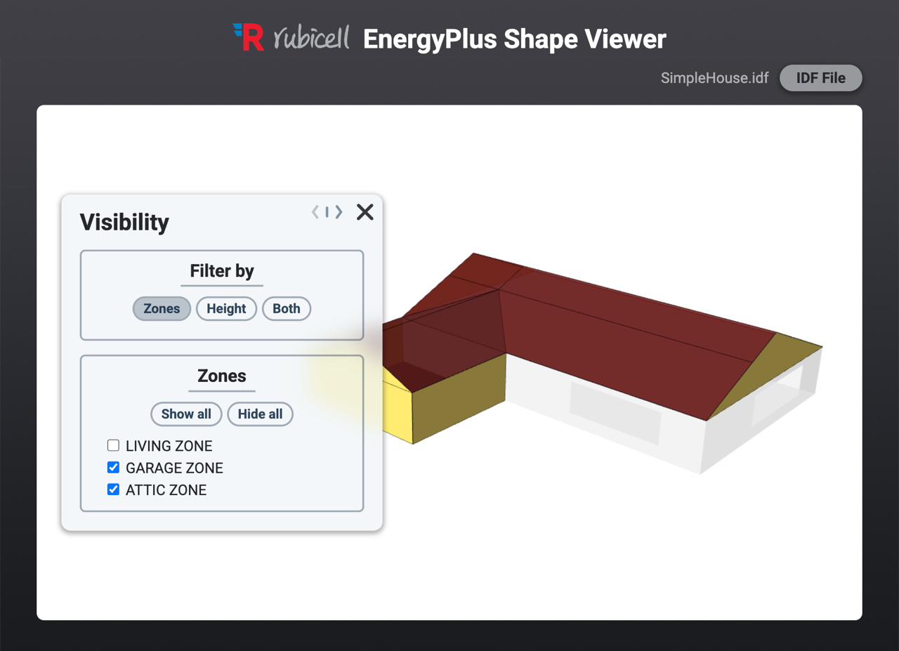
    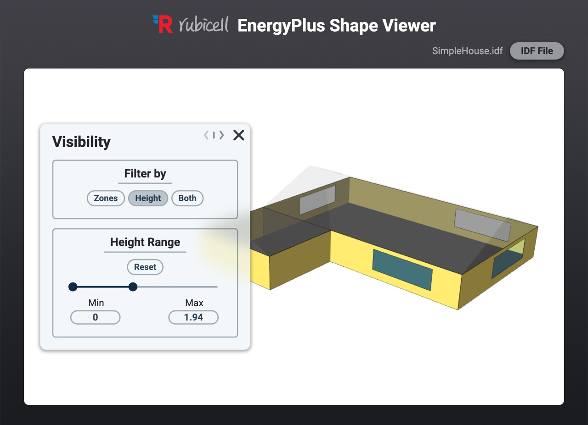
     
    Toggle visibility of zones individually, by the height range, or both.

### View customizations

- Visibility of shading surfaces can be toggled.
- Edge thickness can be adjusted.
- How hidden objects (zones and shading surfaces) are displayed can be customized. 'disable', 'wireframe', and 'ghost' options are available.
- Shadows can be turned on for better visuals. More advanced settings regarding shadows are available through the command prompt.
  <!-- TODO -->
- Transparency in materials can be disabled (does not apply to windows, doors, and shading surfaces).
- The 'Debug' option toggles the axes (x: red, y: green, z: blue)
  as well as the north axis of the building in green, dashed line.

    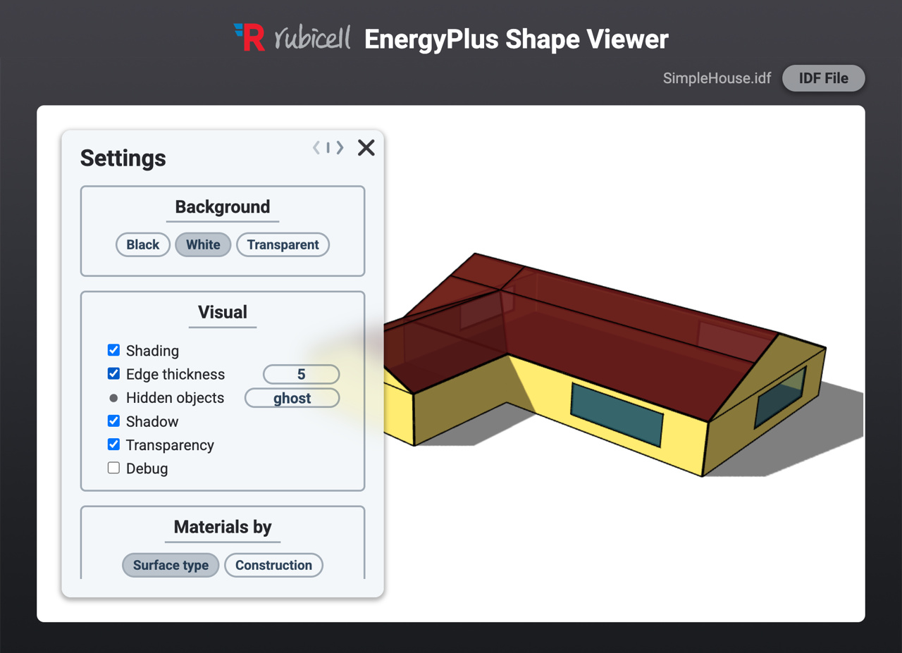
     
    Various customization options are provided.

Surfaces can be colored based on either surface types or constructions. All the materials' opacity and color can be modified, useful for either customizing the view for rendering or highlighting certain constructions of interest in a model.

    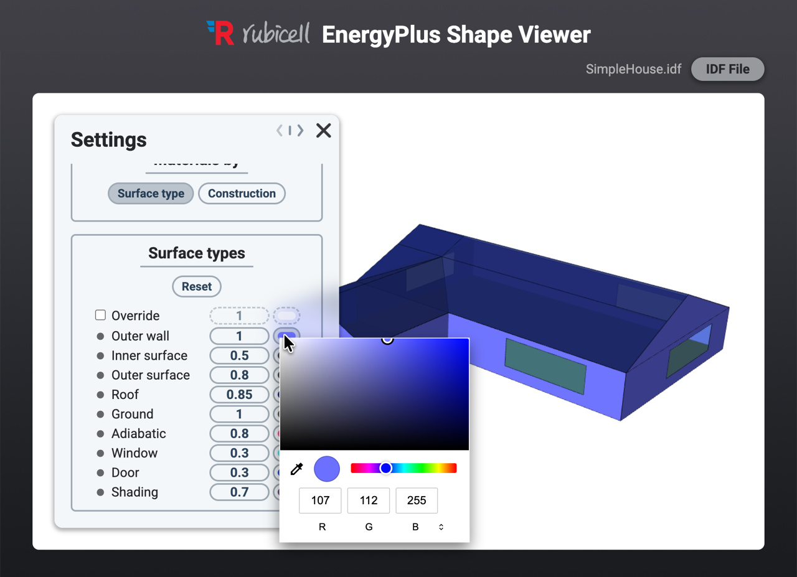
    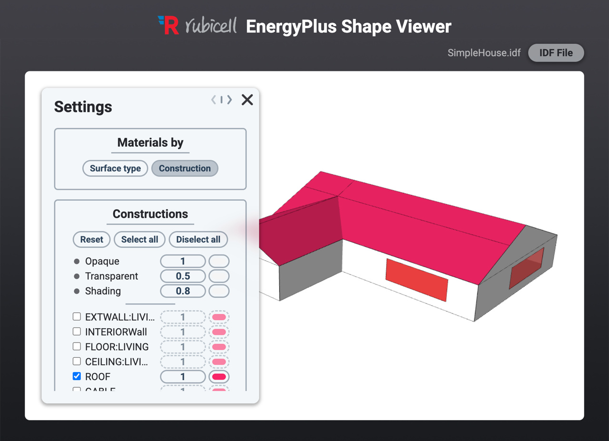
     
    Materials can be customized based on either surface types or constructions.

### Additional features

Settings can be copied and pasted for repeatability. Press `ctrl+shift+c` to select which settings or properties to be copied. A string of code containing the settings will be copied to the clipboard. Pasting this string to the viewer using `ctrl+shift+v` will apply the copied settings to the current viewport.

    Example of a copied settings text : <code>##EPShpSttgs##;zv:0;sh:1;et:-1;hm:2;cp:8.6/8.4/2.3;</code>

    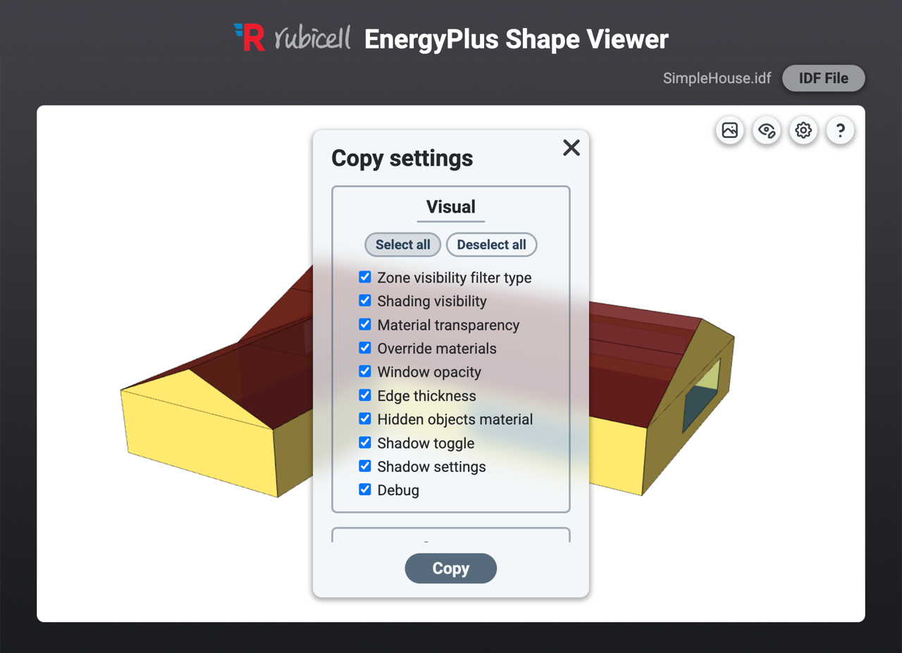
     
    Copy Settings panel.

Viewport resolution can be adjusted through a URL parameter `mult`. When connecting to the website, add '`?mult=(num)`' at the end of the URL to adjust the multiplier for the resolution. (Default is 1).

    Example for the multiplier of 1.5 : <a href="https://chp-rubicell.github.io/epshape?mult=1.5">
        https://chp-rubicell.github.io/epshape<b><u>?mult=1.5</u></b>
    </a>

Current viewport can be exported as an image file either by pressing the 'Save as Image' button or by hitting the `s` key.

### Command prompt

Additional settings and features are available via the command prompt. Hitting the `/` key to open the command prompt input field.
Currently available commands are as follows:

#### Basics

- `help` : See the list of available commands.
- `↑` (up arrow) : Insert the last executed command.

#### Camera

- `camerafar (num)` : Set the camera frustum far plane (how far from the camera to be rendered) to `(num)`. Default is 1000.
- `maxzoom (num)` : Set the max camera zoom distance to `(num)`. Default is 950.
- `camerafov (num)` : Set the field of view (FOV) of the camera to `(num)`°. Default is 30.
- `animatecamera (num)(cw|ccw)` : Export `(num)` animated frames of the camera rotating in clockwise (`cw`) or counterclockwise (`ccw`) direction.
- `animateheight (num)(up|dn)` : Export `(num)` animated frames of the building slice swiping from bottom to up (`up`) or top to bottom (`dn`).

#### Shadows

- `shadowalt (num)` : Set the altitude of the shadow's light source to `(num)`°. Default is 45.
- `shadowazm (num)` : Set the azimuth (relative to the camera) of the shadow's light source to `(num)`°. Default is 90.
- `shadowmapsize (num)` : Set the resolution of the shadow map size to `(num)`×`(num)`. Default is 1024.
- `shadowradius (num)` : Set the shadow's blur to `(num)`×`(num)`. Default is 1.
- `shadowheight (num)` : Set the height (z) of the shadow-catching plane to `(num)`m. Default is 0.
- `selfshadow (on|off)` : Toggle self shadow (casting shadow on itself). Default is `off`.

    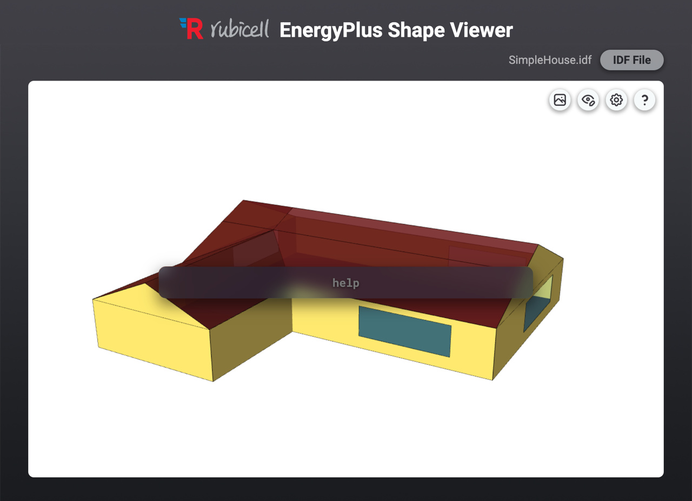
    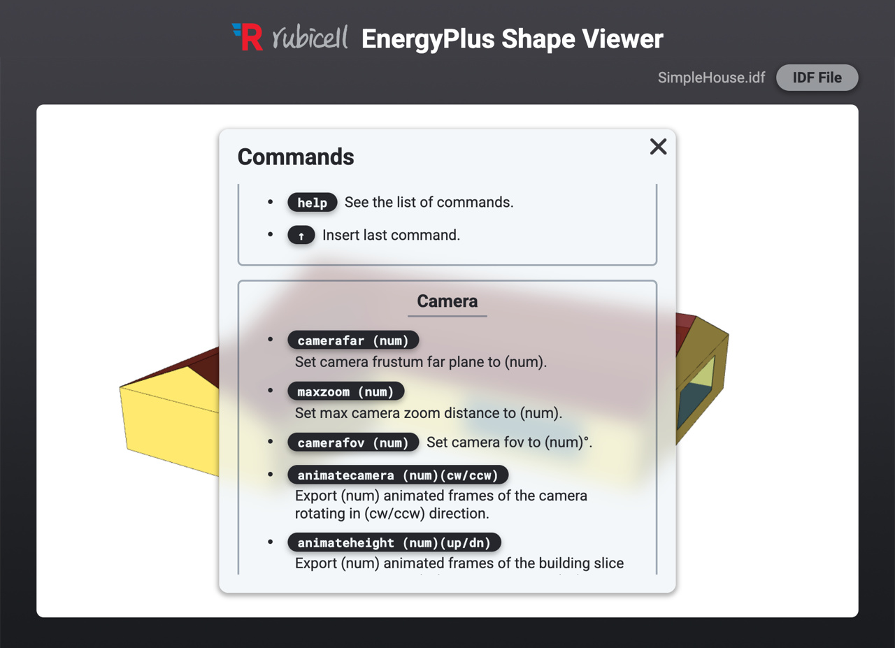
     
    Command prompt UI.

## Acknowledgement

This viewer was developed using [three.js](https://github.com/mrdoob/three.js) and [earcut](https://github.com/mapbox/earcut).

## License

Distributed under the [MIT License](LICENSE).
