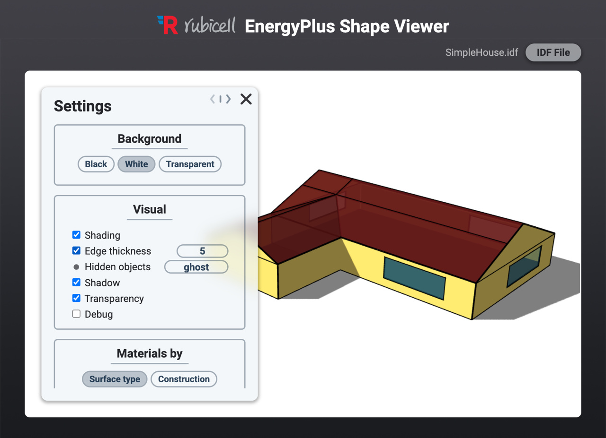

    <a href="https://chp-rubicell.github.io/epshape">
        <!--   -->
         
        
    </a>

    

**EPShape** is a 3D interactive web-based shape viewer for EnergyPlus Input Data Files (`.idf`) and is a crucial tool for intuitively understanding and checking the IDF model.

## Key Features

- **View IDF model shapes** : Parse the shape information (zones, surfaces, fenestrations, etc.) defined in the `.idf` file and display them in an interactive viewer.
- **Web-based** : Works in modern browsers without the need for installation or dependencies.
- **Compatibility** : Compatible with a wide range of EnergyPlus versions (8.9.0 ~).
- **Compatibility** : Inspect properties of surfaces, fenestrations, and shadings by simply mousing over objects.
- **Customization** : Offers extensive customizations for not only convenient model checking but also rendering high-quality image files fit for various purposes.

## Usage

### Basic navigation

    
     
    Open an <code>.idf</code> file by simply dragging and dropping the file on to the viewer or by pressing the 'IDF File' button.

    
     
    Use the left mouse to rotate the camera and the right or middle mouse to pan the camera.

### Inspect model

    
     
    You can mouseover any object to see its properties (name, construction, zone, etc.).

    
    
     
    Toggle visibility of zones individually or by the height range.

### Customizations

    
     
    Various customization options are provided.

    
    
     
    Materials can be customized based on either surface types or constructions.

### Additional functionalities

    
     
    Settings can be copied and pasted for repeatability.

    
    
     
    Additional settings and functionalities are available via the command prompt. (Type <code>help</code> for more information)

    
     
    For more information, press the help ('?') button in the upper right corner.

## Acknowledgement

Made using [three.js](https://github.com/mrdoob/three.js).

## License

Distributed under the [MIT License](LICENSE).
