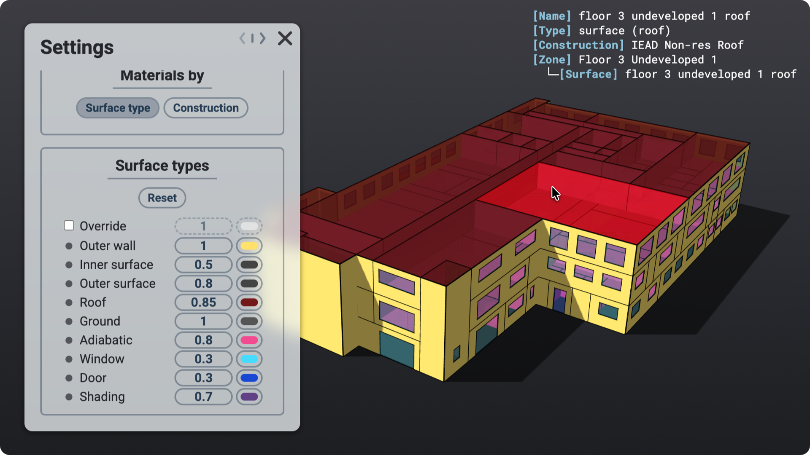
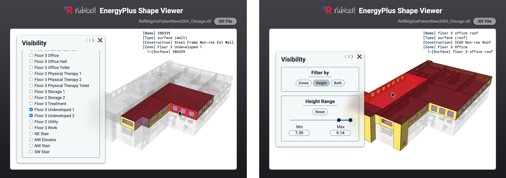
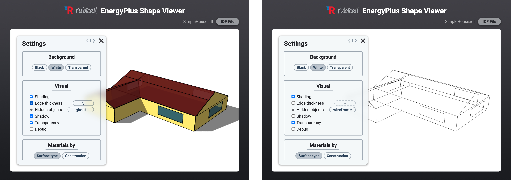
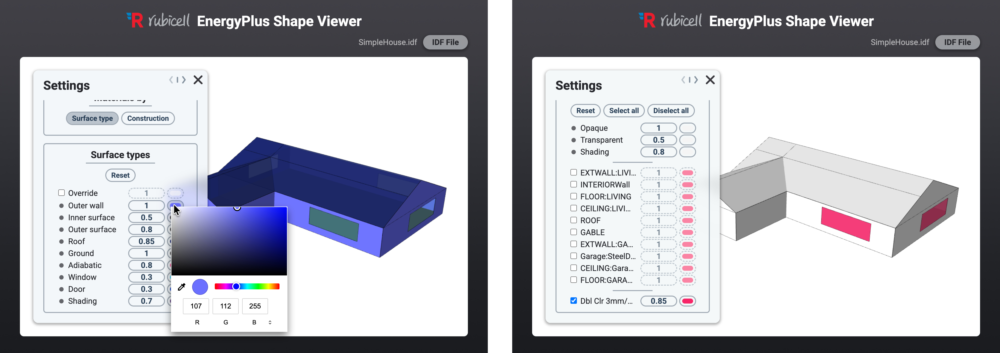

# Summary

EPShape ([https://chp-rubicell.github.io/epshape](https://chp-rubicell.github.io/epshape)) is an open-source, web-based application designed for the visualization and inspection of EnergyPlus building energy models. It offers a range of view customization capabilities that enable comprehensive shape analysis, effective model inspection, and highly configurable renderings suitable for various analytical and presentation purposes. EnergyPlus Input Data Files (`.idf`) can be parsed by simply dragging and dropping them onto the viewer, allowing users to examine building geometry as well as various model components and properties (e.g., thermal zones, surfaces, fenestrations, and constructions).

{ width=65% }

# Statement of need

Although the EnergyPlus Input Data File (IDF) is a text-based format, interpreting and visualizing building geometry and associated properties such as surface types and constructions is far from intuitive.

The IDF format relies on a flat, sequential architecture without any hierarchical organization. As a result, dependencies between properties (e.g., thermal zones, building surfaces, and constructions) are not explicitly represented, requiring jumping back and forth to identify related entities, which makes model interpretation highly unintuitive. This difficulty is further exacerbated for geometric data, where each surface is defined by a series of vertices specified in three-dimensional Cartesian coordinates (X, Y, Z), making direct comprehension impractical without dedicated visualization tools.

Despite these challenges, there has been a notable lack of accessible tools within the building energy modeling domain capable of directly and easily visualizing and inspecting `.idf` files. While existing modeling tools such as DesignBuilder [@designbuilder], OpenStudio [@openstudio], and Rhino with Honeybee [@ladybugtools] offer integrated viewers and inspectors for modeling purposes, these programs exhibit several limitations, including restricted support for externally generated `.idf` files, substantial installation and configuration requirements, and, in some cases,  paid licensing constraints. Furthermore, variations in IDF formats across EnergyPlus versions frequently result in compatibility issues, requiring multiple separate installations to support different EnergyPlus versions.

EPShape was developed to address these limitations. EPShape is a lightweight, web-based application that works in modern web browsers without the need for installation or dependencies. It supports a broad range of EnergyPlus versions (tested for 8.9.0 and later) and offers extensive customization features for both efficient model inspection and the generation of high-quality renders fit for academic publications and presentations.

# Software description

EPShape provides a wide range of tools that enable efficient model inspection and flexible rendering customization. Detailed descriptions and documentation are available in the GitHub repository ([https://github.com/chp-rubicell/EPShape](https://github.com/chp-rubicell/EPShape)). The source code is also archived in the Zenodo repository ([https://doi.org/10.5281/zenodo.16790187](https://doi.org/10.5281/zenodo.16790187)).

{ width=95% }

{ width=95% }

{ width=95% }

# Software design

EPShape was developed in JavaScript and is deployed as a GitHub Pages web application  ([https://chp-rubicell.github.io/epshape](https://chp-rubicell.github.io/epshape)). The libraries `three.js` [@threejs] and `earcut` [@earcut] were used for 3D rendering and surface triangulation, respectively. Although EPShape was primarily designed as a web-based application for ease of access and use, all functionalities are implemented in client-side JavaScript, and thus it can also be readily executed locally with `index.html` and the accompanying files located in the `resources/` directory.

# References
